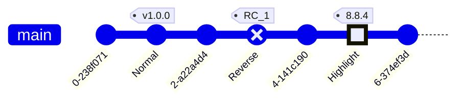
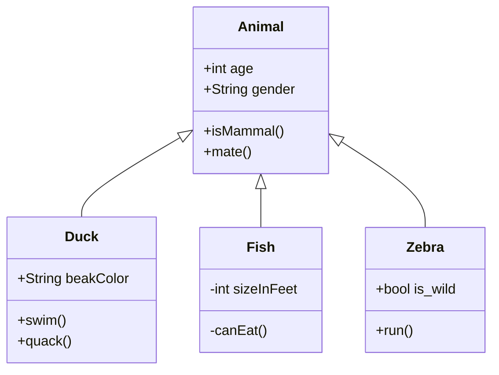

# Mermaid test

```mermaid
 gitGraph
       commit
       commit id: "Normal" tag: "v1.0.0"
       commit
       commit id: "Reverse" type: REVERSE tag: "RC_1"
       commit
       commit id: "Highlight" type: HIGHLIGHT tag: "8.8.4"
       commit
```

```mermaid
classDiagram
      Animal <|-- Duck
      Animal <|-- Fish
      Animal <|-- Zebra
      Animal : +int age
      Animal : +String gender
      Animal: +isMammal()
      Animal: +mate()
      class Duck{
          +String beakColor
          +swim()
          +quack()
      }
      class Fish{
          -int sizeInFeet
          -canEat()
      }
      class Zebra{
          +bool is_wild
          +run()
      }
```
